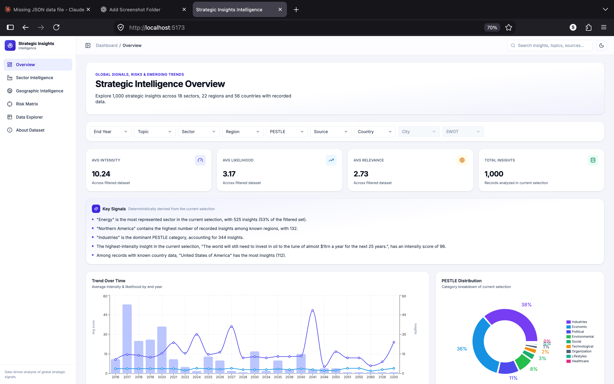
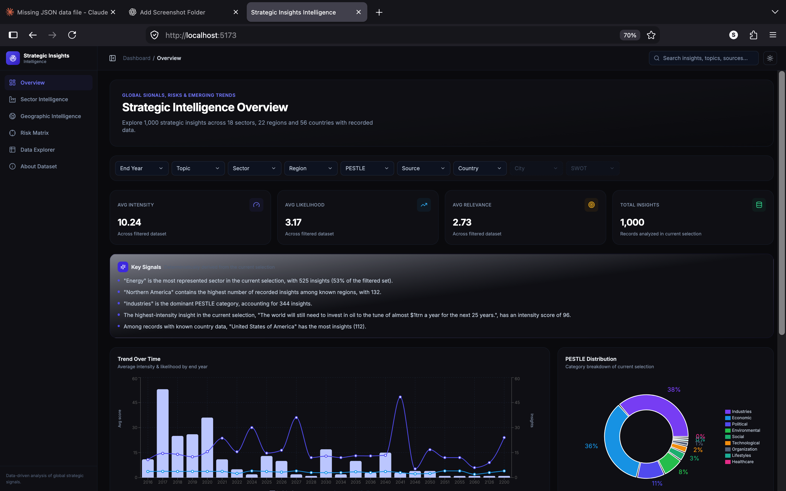
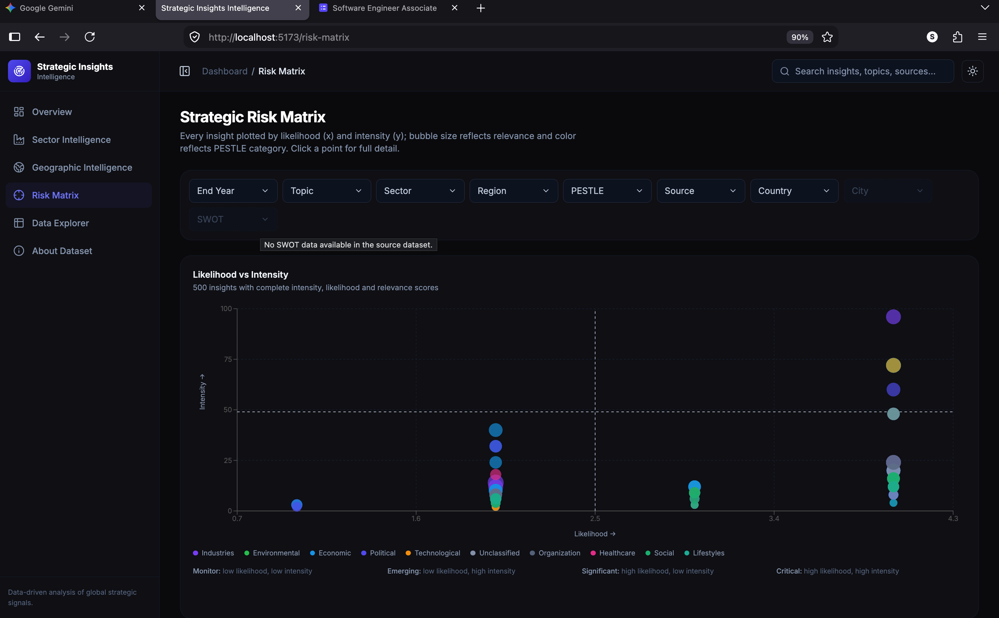
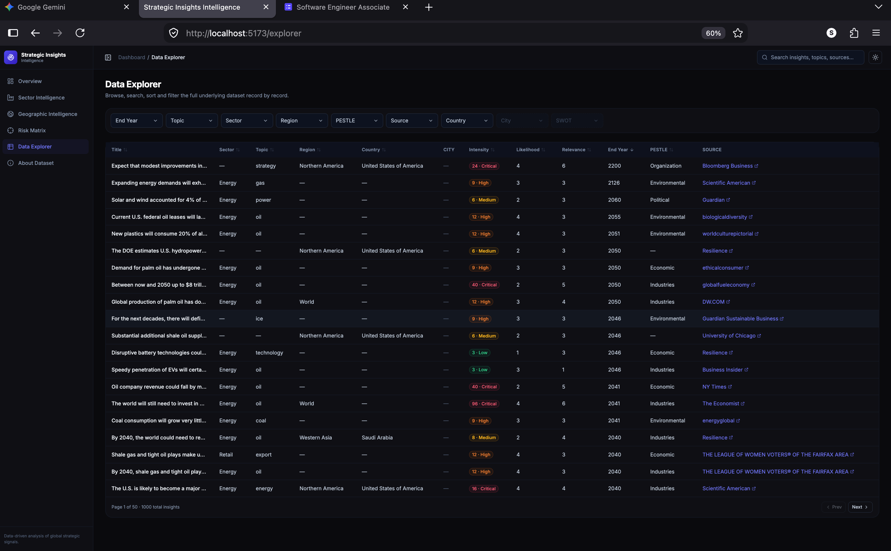

# Strategic Insights Intelligence
Strategic Insights Intelligence — Full-Stack Data Visualization Dashboard

Live Application: https://strategic-insights-intelligence.vercel.app


Backend API: https://strategic-insights-intelligence.onrender.com

**Global signals, risks & emerging trends** — a data visualization dashboard built for the Blackcoffer Data Visualization Dashboard Test Assignment.

A full-stack application (Node.js/Express/TypeScript/MongoDB backend + React/TypeScript/Vite/Tailwind frontend) that imports the supplied `jsondata.json` dataset into MongoDB, exposes it through a REST + aggregation API, and visualizes it through six purpose-built charts, a filterable data explorer, and a deterministic "Key Signals" panel — all driven entirely by the real data, with no fabricated values anywhere.

---

## Table of Contents

1. [Screenshots](#screenshots)
2. [Architecture](#architecture)
3. [Tech Stack](#tech-stack)
4. [Prerequisites](#prerequisites)
5. [MongoDB Setup](#mongodb-setup)
6. [Environment Variables](#environment-variables)
7. [Installation](#installation)
8. [Seeding the Database](#seeding-the-database)
9. [Development](#development)
10. [Production Build](#production-build)
11. [Docker](#docker)
12. [API Documentation](#api-documentation)
13. [Project Structure](#project-structure)
14. [Design Decisions](#design-decisions)
15. [Data Normalization Decisions](#data-normalization-decisions)
16. [SWOT & City Handling Decision](#swot--city-handling-decision)
17. [Analytics Methodology](#analytics-methodology)
18. [Performance Decisions](#performance-decisions)
19. [Known Limitations](#known-limitations)

---

## Screenshots


### Overview — Light Mode



### Overview — Dark Mode


### Risk Matrix



### Data Explorer



## Architecture

```
┌──────────────────────┐        HTTP/JSON        ┌───────────────────────┐        Mongoose        ┌───────────────┐
│   React + Vite SPA   │  ───────────────────▶   │  Express + TypeScript │  ───────────────────▶  │    MongoDB    │
│  (frontend/, :5173)  │  ◀───────────────────   │   API (backend/, :5001)│  ◀───────────────────  │  (insights)   │
└──────────────────────┘                          └───────────────────────┘                         └───────────────┘
        │                                                    │
        │  TanStack Query (cache + refetch)                  │  Aggregation pipelines
        │  URL-synced filters (React Router)                 │  compute analytics server-side
        ▼                                                    ▼
  Recharts visualizations                          summary / sector / topic / pestle /
  (risk matrix, sector, time,                       region / country / source / year /
  geo, PESTLE, topic/source)                         riskMatrix / keySignals
```

- The frontend never computes dashboard aggregates client-side from a full dataset dump — every number shown (KPIs, chart values, key signals) comes from a MongoDB aggregation pipeline exposed via `/api/insights/analytics`.
- All dashboard filters live in the URL query string (`useFilters` hook), so any filtered view is shareable/bookmarkable and there's a single source of truth instead of duplicated component state.

## Tech Stack

**Backend:** Node.js, Express, TypeScript, MongoDB, Mongoose, Helmet, CORS, Morgan
**Frontend:** React 18, TypeScript, Vite, Tailwind CSS, TanStack Query, React Router, Recharts, Lucide React, Axios
**Dev tooling:** ESLint, Prettier, ts-node, nodemon
**Infra:** Docker + docker-compose (optional)

## Prerequisites

- Node.js 20+
- npm 10+
- A running MongoDB instance — either:
  - Local MongoDB (see below), or
  - A free [MongoDB Atlas](https://www.mongodb.com/atlas) cluster

## MongoDB Setup

**Option A — Local MongoDB**

Install MongoDB Community Edition for your OS (see [official docs](https://www.mongodb.com/docs/manual/administration/install-community/)), then start it:

```bash
mongod --dbpath /path/to/your/data/dir
```

It will be reachable at `mongodb://127.0.0.1:27017`.

**Option B — Docker**

```bash
docker run -d --name sii-mongo -p 27017:27017 mongo:7
```

**Option C — MongoDB Atlas**

Create a free cluster, create a database user, allow your IP, and copy the `mongodb+srv://...` connection string into `MONGODB_URI`.

## Environment Variables

Copy the example files and fill in as needed:

```bash
cp backend/.env
cp frontend/.env
```

**backend/.env**

| Variable      | Description                     | Default                                        |
| ------------- | ------------------------------- | ---------------------------------------------- |
| `PORT`        | API server port                 | `5001`                                         |
| `NODE_ENV`    | `development` \| `production`   | `development`                                  |
| `MONGODB_URI` | MongoDB connection string       | `mongodb://127.0.0.1:27017/strategic_insights` |
| `CORS_ORIGIN` | Comma-separated allowed origins | `http://localhost:5173`                        |

**frontend/.env**

| Variable            | Description          | Default                     |
| ------------------- | -------------------- | --------------------------- |
| `VITE_API_BASE_URL` | Backend API base URL | `http://localhost:5001/api` |

## Installation

Backend and frontend are separate npm projects (no shared root package.json), so install each independently:

```bash
cd backend
npm install

cd ../frontend
npm install
```

## Seeding the Database

The seed script reads `jsondata.json` from the project root, normalizes it, and bulk-inserts it into MongoDB. It is idempotent — running it multiple times always converges to the same 1000 (or however many are valid) documents rather than duplicating data.

```bash
cd backend
npm run seed
```

Example output:

```
=== Strategic Insights - Database Seed ===
Reading dataset from: /path/to/jsondata.json
Records read: 1000

=== Seed Report ===
Records read:        1000
Records inserted:    1000
Records skipped:     0 (missing required title)
Normalization notes: 38 records had a value that needed normalization

Seed complete.
```

## Development

Run backend and frontend in two terminals:

```bash
# Terminal 1
cd backend
npm run dev        # http://localhost:5001

# Terminal 2
cd frontend
npm run dev         # http://localhost:5173
```

Visit `http://localhost:5173`.

## Production Build

```bash
# Backend
cd backend
npm run build
npm start

# Frontend
cd frontend
npm run build
npm run preview     # or serve dist/ with any static file server / nginx
```

## Docker

A `docker-compose.yml` at the project root spins up MongoDB, the backend API, and the frontend (served via nginx):

```bash
docker compose up --build -d
```

Seeding is deliberately **not** run automatically on every `up` — the seed script is destructive (it clears the collection before re-inserting, to stay idempotent), so it should only run when you explicitly ask for it, not every time the stack restarts. Run it once, as a one-off job, after the stack is up:

```bash
docker compose run --rm seed
```

This uses a dedicated `seed` service (see `docker-compose.yml`) that shares the backend's Dockerfile/image, connects to the same `mongo` container over the compose network, and reads `jsondata.json` from the same read-only bind mount the backend uses — no manual `exec`-ing into a running container or juggling host-vs-container Mongo URIs required. It's safe to re-run any time you want to reset back to a clean seeded state.

Once seeded, the app is live at `http://localhost:5173` (frontend) talking to `http://localhost:5001/api` (backend).

## API Documentation

Base URL: `http://localhost:5001/api`

| Method | Endpoint              | Description                                                                                                                           |
| ------ | --------------------- | ------------------------------------------------------------------------------------------------------------------------------------- |
| GET    | `/health`             | Health check — reports API and MongoDB connectivity status                                                                            |
| GET    | `/insights`           | Paginated, filterable, sortable, searchable list of insights                                                                          |
| GET    | `/insights/filters`   | Distinct values for every filter dimension, computed live from the data                                                               |
| GET    | `/insights/analytics` | All aggregated dashboard data (summary, per-dimension breakdowns, risk matrix, key signals), respects the same filters as `/insights` |
| GET    | `/insights/:id`       | Full detail for a single insight                                                                                                      |

**Query parameters shared by `/insights` and `/insights/analytics`:**

`end_year`, `topic`, `sector`, `region`, `pestle`, `source`, `country`, `city`, `swot` — each accepts a single value or a comma-separated list (OR within the field, AND across fields). `q` performs full-text search across title/insight text/topic.

**Additional parameters for `/insights`:** `page` (default 1), `limit` (default 20, max 100), `sortBy` (one of `title`, `sector`, `topic`, `region`, `country`, `intensity`, `likelihood`, `relevance`, `endYear`, `added`, `published`), `sortOrder` (`asc` | `desc`).

Example:

```
GET /api/insights/analytics?sector=Energy,Manufacturing&region=Northern%20America
GET /api/insights?page=2&limit=20&sortBy=intensity&sortOrder=desc&topic=gas
```

## Project Structure

```
/
├── backend/
│   ├── src/
│   │   ├── config/db.ts
│   │   ├── models/Insight.ts
│   │   ├── controllers/insightController.ts
│   │   ├── routes/insightRoutes.ts, healthRoutes.ts
│   │   ├── services/analyticsService.ts, filterService.ts, filterOptionsService.ts
│   │   ├── utils/normalize.ts, intensityLevel.ts
│   │   ├── middleware/errorHandler.ts
│   │   ├── types/insight.ts
│   │   └── app.ts, server.ts
│   ├── scripts/seed.ts
│   └── package.json, tsconfig.json, Dockerfile, .env.example
├── frontend/
│   ├── src/
│   │   ├── api/client.ts, queries.ts
│   │   ├── components/
│   │   │   ├── layout/ (Sidebar, Navbar)
│   │   │   ├── kpi/ (KpiCard)
│   │   │   ├── filters/ (FilterBar, FilterDrawer, FilterToolbar, MultiSelect)
│   │   │   ├── charts/ (RiskMatrixChart, SectorChart, TimeChart, GeoChart, PestleChart, TopicSourceChart)
│   │   │   ├── common/ (ChartCard, EmptyState, LoadingSkeleton, MetricBadge/PageHeader)
│   │   │   ├── table/ (DataTable)
│   │   │   ├── drawer/ (InsightDrawer)
│   │   │   └── signals/ (KeySignals)
│   │   ├── pages/ (Overview, SectorIntelligence, GeographicIntelligence, RiskMatrixPage, DataExplorer, AboutDataset, NotFound)
│   │   ├── hooks/ (useFilters, useTheme, useDebounce)
│   │   ├── lib/utils.ts
│   │   ├── types/insight.ts
│   │   └── App.tsx, main.tsx, index.css
│   └── package.json, tsconfig.json, vite.config.ts, tailwind.config.js, Dockerfile, .env.example
├── docs/
│   └── screenshots/
│       ├── overview-light.png
│       ├── overview-dark.png
│       ├── risk-matrix.png
│       └── data-explorer.png
├── jsondata.json
├── docker-compose.yml
├── .gitignore
└── README.md
```

## Design Decisions

- **URL-synchronized filters.** All 9 assignment-required filters live in the URL query string via a single `useFilters` hook, so every chart and the table read from one source of truth and filtered views are shareable.
- **Aggregation-first analytics.** `/api/insights/analytics` returns every number the dashboard needs — nothing is computed by fetching all rows into the browser and reducing client-side.
- **Progressive disclosure.** The Overview page shows KPIs, Key Signals, a trend chart, a PESTLE donut, and sector breakdown. Deeper drill-downs (full risk matrix, full sector/topic/source breakdown, full geography, raw table) live on their own dedicated pages reachable from the sidebar, rather than cramming everything onto one screen.
- **Click-to-filter everywhere.** Clicking a sector bar, PESTLE slice, region/country bar, topic/source bar, or risk-matrix point updates the global filter state (or opens the detail drawer for a point), so exploration doesn't require re-opening a filter dropdown.
- **No world-map library.** A true choropleth world map would require bundling external geographic boundary/ID-mapping data whose country-name matching against this specific dataset's country strings could silently misrepresent counts (per the assignment's own caution against "external geographic data that creates misleading statistics"). Instead, Geographic Intelligence uses a ranked, switchable region/country bar visualization built entirely from the dataset's own values — accurate over decorative.

## Data Normalization Decisions

Verified directly by parsing all 1000 records in `jsondata.json` before writing any code:

- **No fabrication.** Empty strings (`""`) become `null` for every field — never coerced into a fake category or into `0`.
- **Numeric parsing.** `intensity`, `likelihood`, `relevance`, `impact`, `start_year`, `end_year` are safely parsed; unparseable or empty values become `null` (38 of 1000 records have an empty `intensity`; these are excluded from intensity-based averages and the risk matrix rather than counted as zero).
- **String trimming.** All categorical fields are trimmed of whitespace.
- **Casing fix-up.** One genuine inconsistency was found and merged: the `region` field contains both `"world"` and `"World"` as separate raw values — these are unified to `"World"`. No other values were altered or invented.
- **Dates.** `added` / `published` (format `"Month, DD YYYY HH:mm:ss"`) are parsed into real `Date` objects; anything unparseable becomes `null`.
- **Intensity level thresholds are data-derived, not arbitrary.** Raw `intensity` ranges from 1–96 (not the commonly assumed 0–10), heavily right-skewed (median 8). Low/Medium/High/Critical bands were set at the dataset's own quartile boundaries: Low ≤ 4, Medium 5–8, High 9–12, Critical > 12 — used consistently by both the API and the UI so labels never disagree.

## SWOT & City Handling Decision

Both were inspected directly in `jsondata.json` before any schema or filter was designed:

- **`city` does not exist anywhere in the source dataset** — 0 of 1000 records have this key.
- **`swot` does not exist anywhere in the source dataset** — 0 of 1000 records have this key, and no other field provides a legitimate, non-arbitrary basis to derive a Strength/Weakness/Opportunity/Threat classification.

Both filters are fully implemented end-to-end (backend query support, `/insights/filters` reports which are available, frontend renders them) but honestly reflect this: the filter controls are disabled with a "not available in source data" tooltip, the About Dataset page states this plainly, and `GroupBy` queries on these fields simply return empty result sets rather than a dashboard that silently shows nothing with no explanation.

## Analytics Methodology

All analytics are computed via MongoDB aggregation pipelines (`analyticsService.ts`), scoped by whatever filter is currently active:

- **Summary:** total count, average intensity/likelihood/relevance (over non-null values only), distinct sector/region/country counts.
- **Group breakdowns** (sector, topic, pestle, region, country, source): count + average intensity (+ relevance for sector) per value, excluding null values from the grouping so there's no fabricated "Unknown" bucket.
- **Year trend:** grouped by `endYear`, explicitly excluding records with no `end_year` — the UI states exactly how many records were excluded and why, rather than silently treating them as year 0.
- **Risk matrix:** every record with non-null intensity, likelihood, and relevance (capped at 500 points, which comfortably covers this dataset).
- **Key Signals:** five deterministic sentences generated from the same aggregation results already computed for the charts (top sector, top region, top PESTLE, highest-intensity record, top country) — never an LLM, never hardcoded text.

## Performance Decisions

- Server-side pagination and sorting for the Data Explorer (never ships the full collection to the browser).
- All dashboard math happens in MongoDB aggregation pipelines, not client-side reduction over a full dump.
- Debounced (400ms) global search input.
- Route-level code splitting (`React.lazy` + `Suspense`) — chart libraries load only when a page that uses them is visited; verified via production build output (`vite build`) showing a dedicated `charts-vendor` chunk alongside per-page chunks well under the 500kB warning threshold.
- Indexes on every frequently-filtered field (`sector`, `topic`, `region`, `country`, `city`, `pestle`, `source`, `endYear`) plus a compound `{sector, region}` index for the common combined-filter query shape, plus a text index for search — deliberately not "dozens" of unjustified indexes.
- `useMemo` around chart data transformations (quadrant midpoints, grouped series) to avoid recomputation on unrelated re-renders.

## Known Limitations

- **No live database in the delivered environment.** This codebase was built and verified (both `backend` and `frontend` typecheck and build cleanly with `tsc` / `vite build`, and the seed script's normalization logic was run against the real `jsondata.json` and confirmed correct) but was not executed end-to-end against a live MongoDB instance as part of this delivery, because no MongoDB server was available in the build sandbox. Running `npm run seed` and `npm run dev` locally against your own MongoDB (steps above) will bring the app fully online.
- **No true world map / choropleth.** See "Design Decisions" above for the reasoning; Geographic Intelligence uses ranked region/country bar charts instead.
- **City and SWOT filters are non-functional by data reality, not by omission** — see the dedicated section above.
- Only 350/1000 records have a recorded `country` and 258/1000 have a recorded `end_year`; geographic and time-trend visualizations are therefore based on meaningfully smaller subsets of the full dataset, which is stated explicitly in the UI rather than hidden.
